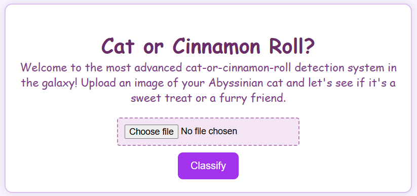

# cat-or-roll
Have you ever found yourself looking at the cat thinking -- hm, is it a cat or a cinnamon roll? Such situations are especially common for the owners of Abyssinian cats! This service-classificator: you can upload the picture of your Abyssinian cat and the algorithm will help you determine whether it's a cat or cinnamon roll.
Overview
--------
This Flask-based web service classifies uploaded images as either a cat or a cinnamon roll. It leverages a PyTorch model for image classification and provides a  purple-themed UI that displays the prediction with a confidence percentage.

Features
--------
- **Single-Page UI**: Upload an image via a  web interface.


- **Image Classification**: Determines if the uploaded image is a cat or a cinnamon roll.
- **Confidence Display**: Results are formatted as:
  "I am 92.50% sure it's a Cat!"
- **Configurable**: Uses Pydantic Settings to configure the model path, allowed file extensions, host, port, and debug mode.
- **API Access**: Provides a JSON API endpoint (`POST /classify`) for programmatic use.

Installation
------------
1. **Clone the Repository:**

 ```bash
   poetry install --no-root 
 ```

2. **Run the Service** 
```bash
   python -m cat_or_roll
```


*Optional*: You can configure a different path using the environment variable **CLASSIFIER__LOCATION** for your own model.